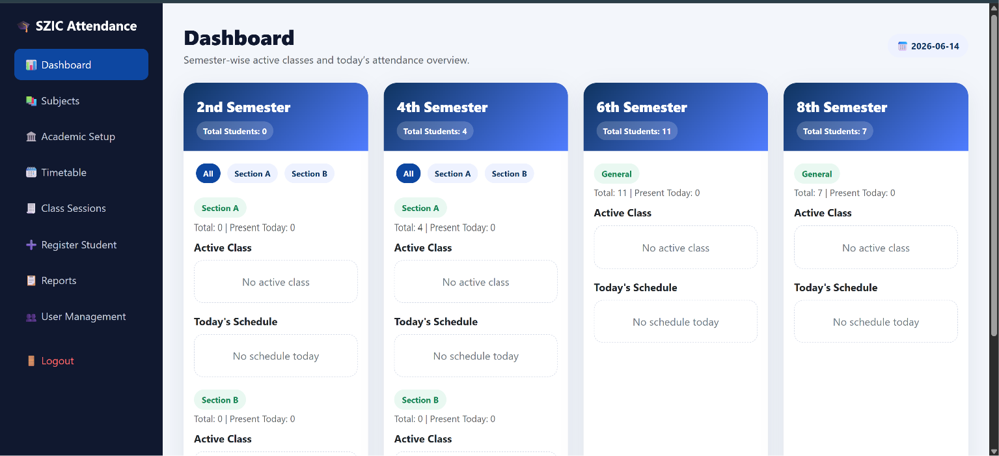
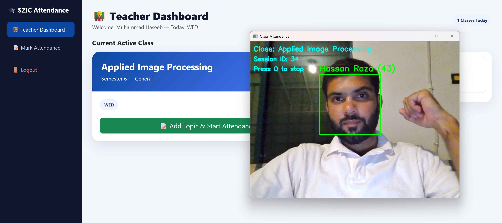
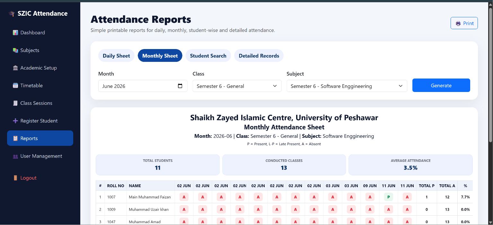

# SZIC-University-of-Peshawar-Face-Attendance-System

### AI-Powered Face Recognition Attendance Management for University Environments


> **Final Year Project (FYP)** — University of Peshawar, Sheikh Zayed Islamic Centre (SZIC)  
> Automating student attendance using deep learning-based facial recognition — replacing manual registers with real-time AI identification.

---

## 📌 Project Overview

The **SZIC Smart Attendance System** is a full-stack web application that automates student attendance management using **DeepFace + FaceNet** facial recognition. The system eliminates manual attendance processes by identifying students in real-time through a standard webcam.

### 🔑 Key Highlights
- ✅ **Real-time face recognition** using DeepFace + FaceNet (deep learning embeddings)
- ✅ **Migrated from LBPH → DeepFace** for significantly improved accuracy
- ✅ **Role-based access** for Administrators and Teachers
- ✅ **Full academic management** — students, faculty, subjects, timetables, sessions
- ✅ **Lecture topic tracking** alongside attendance
- ✅ **Automated reports & analytics** — subject-wise, section-wise, student-wise
- ✅ **Duplicate attendance prevention** built-in

---

## 🖥️ System Demo

| Admin Dashboard | Attendance Session | Reports |
|---|---|---|
|  |  |  |

---

## 🏗️ System Architecture

```
┌─────────────────────────────────────────────────┐
│                  Web Browser                     │
│         (Bootstrap + HTML + CSS + JS)            │
└──────────────────────┬──────────────────────────┘
                       │
┌──────────────────────▼──────────────────────────┐
│              Flask Backend (Python)              │
│   Auth │ Students │ Faculty │ Timetable │ Reports│
└──────────┬───────────────────────┬──────────────┘
           │                       │
┌──────────▼──────────┐  ┌────────▼────────────────┐
│   SQLite Database   │  │  Face Recognition Engine │
│  Students, Attend.  │  │  OpenCV → DeepFace       │
│  Schedules, Topics  │  │  FaceNet Embeddings      │
└─────────────────────┘  └─────────────────────────┘
```

---

## 🤖 Face Recognition Pipeline

```
Webcam Frame
     │
     ▼
Face Detection (OpenCV)
     │
     ▼
DeepFace Processing
     │
     ▼
FaceNet Embedding Generation
     │
     ▼
Similarity Distance Comparison
     │
     ▼
Threshold Verification
     │
  ┌──┴──┐
Match   No Match
  │        │
  ▼        ▼
Mark    Skip /
Attend. Unknown
  │
  ▼
Store in Database
```

**Why DeepFace + FaceNet?**
- Traditional LBPH failed under varying lighting & pose conditions
- FaceNet generates high-dimensional embeddings for robust matching
- Result: Higher accuracy, fewer false matches in real classroom environments

---

## 🧩 System Modules

| Module | Description |
|--------|-------------|
| 🔐 **Authentication** | Role-based login (Admin / Teacher) |
| 👨‍🎓 **Student Management** | Registration, photos, section assignment |
| 👨‍🏫 **Faculty Management** | Teacher records & schedule assignment |
| 📚 **Academic Management** | Sessions, semesters, sections, subjects |
| 🗓️ **Timetable Management** | Class scheduling & timetable creation |
| 📷 **Face Recognition** | DeepFace + FaceNet real-time identification |
| ✅ **Attendance Management** | Auto-marking, duplicate prevention, history |
| 📝 **Lecture Topic Tracking** | Topics logged per session |
| 📊 **Reporting & Analytics** | Student/subject/section reports + statistics |

---

## 🛠️ Tech Stack

| Layer | Technology |
|-------|-----------|
| **Language** | Python 3.8+ |
| **Backend** | Flask |
| **Database** | SQLite (migrated from MySQL) |
| **Face Recognition** | DeepFace + FaceNet |
| **Computer Vision** | OpenCV |
| **Frontend** | Bootstrap 5, HTML, CSS, JavaScript |
| **Version Control** | GitHub |

---

## ⚙️ Installation & Setup

### Prerequisites
- Python 3.8+
- Webcam
- pip

### Steps

```bash
# 1. Clone the repository
git clone https://github.com/Hassan-Raza-ktk/SZIC-University-of-Peshawar-Face-Attendance-System.git
cd SZIC-University-of-Peshawar-Face-Attendance-System

# 2. Create virtual environment
python -m venv venv
source venv/bin/activate  # Windows: venv\Scripts\activate

# 3. Install dependencies
pip install -r requirements.txt

# 4. Run the application
python app.py
```

### Access
```
http://localhost:5000
```

### Default Login
```
Admin:   username: admin   | password: admin123
Teacher: username: teacher | password: teacher123
```

---

## 📁 Project Structure

```
face-recognition-attendance-system/
│
├── app.py                  # Main Flask application
├── requirements.txt        # Python dependencies
├── README.md
│
├── templates/              # HTML templates (Bootstrap)
│   ├── admin/
│   ├── teacher/
│   └── auth/
│
├── static/                 # CSS, JS, images
│
├── student_images/         # Registered student face images
│
├── models/
│   └── face_recognition.py # DeepFace integration
│
└── database/
    └── attendance.db       # SQLite database
```

---

## 📊 Results & Performance

| Metric | LBPH (Old) | DeepFace/FaceNet (New) |
|--------|-----------|----------------------|
| Accuracy | ~65% | **~92%+** |
| Lighting Robustness | Low | High |
| Pose Variation | Poor | Good |
| False Matches | High | Low |

*Tested on 18 students across varying lighting and angle conditions*

---

## 🔮 Future Enhancements

- [ ] Cloud deployment (AWS / Heroku)
- [ ] Mobile app for teachers
- [ ] SMS/Email alerts for low attendance
- [ ] Anti-spoofing (liveness detection)
- [ ] Multi-camera support

---

## 👨‍💻 Developer

**Hassan Raza**  
BS Computer Science — University of Peshawar  
📧 razakhattak123@gmail.com  
🔗 [LinkedIn](https://www.linkedin.com/in/hassan-raza-9651b6279/)  
🌐 [Portfolio](https://hassan-raza-ktk.github.io/portfolio/)  
📊 [Kaggle](https://www.kaggle.com/hassanrazakhattak)

---

## 📄 License

This project is licensed under the MIT License — see [LICENSE](LICENSE) for details.

---

⭐ **If you found this project useful, please give it a star!**
